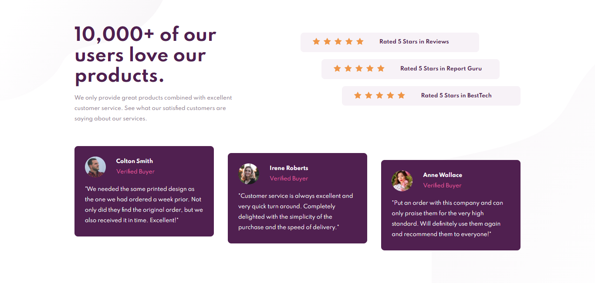

# Frontend Mentor - Social proof section solution

This is a solution to the [Social proof section challenge on Frontend Mentor](https://www.frontendmentor.io/challenges/social-proof-section-6e0qTv_bA).

## Table of contents

- [Overview](#overview)
  - [The challenge](#the-challenge)
  - [Screenshot](#screenshot)
  - [Links](#links)
- [My process](#my-process)
  - [Built with](#built-with)
  - [What I learned](#what-i-learned)
- [Author](#author)


## Overview

### The challenge

Users should be able to:

- View the optimal layout for the section depending on their device's screen size

### Screenshot




### Links

- Solution URL: [Add solution URL here](https://your-solution-url.com)
- Live Site URL: [Add live site URL here](https://your-live-site-url.com)

## My process

### Built with

- Semantic HTML5 markup
- CSS custom properties
- Flexbox
- Mobile-first workflow
- JavaScript


### What I learned

Add multiple similar background images to one `div` using JavaScript:

```js
const starDivs = document.querySelectorAll('.stars');

starDivs.forEach(starDiv => {
    for (let i = 0; i < 5; i++) {
        let imagen = document.createElement('img');
        imagen.src = 'images/icon-star.svg';
        imagen.style.marginRight = '.25rem';
        imagen.style.marginLeft = '.25rem';
        starDiv.appendChild(imagen);
    }
})
```

## Author

- GitHub - [Nguyen Hoang Nam](https://github.com/hoangnam-nguyen)
- Frontend Mentor - [@hoangnam-nguyen](https://www.frontendmentor.io/profile/hoangnam-nguyen)
- CodePen - [@hoangnam-nguyen](https://codepen.io/hoangnam-nguyen)


